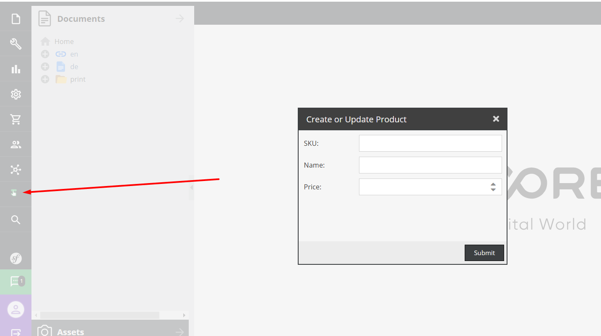

This bundle is tested on demo project of latest pimcore 11 version.
I was not sure about error handling should Internal errors as I found it usefull in this type of bundle.
This bundle will create Product class if it does not exist, if it already exist then you need to add fields sku name and price. 

**Installation**

```bash
composer require dusant94/task-bundle
```

Enable it:
```bash
// config/bundles.php
return [
    // ...
    Dusant\TaskBundle\DusantTaskBundle::class => ['all' => true],
];
```

Install:
```bash
php bin/console pimcore:bundle:install DusantTaskBundle
``` 

**Uninstall**

```bash
php bin/console pimcore:bundle:uninstall DusantTaskBundle
``` 

```bash
composer remove dusant94/task-bundle
```

**Updating or creating Product with command**
```bash
php bin/console dusant:create-or-update-product --sku="<SKU>" --price=<PRICE> --name="<PRODUCT_NAME>"
``` 

**Updating or creating Product with api endpoint**
```bash
curl --location 'http://localhost/product/create-or-update' \
--header 'Content-Type: text/plain' \
--data '{
  "sku": "<SKU>",
  "price": <PRICE>,
  "name": "<PRODUCT_NAME>",
}'
``` 
**Custom modal form**


